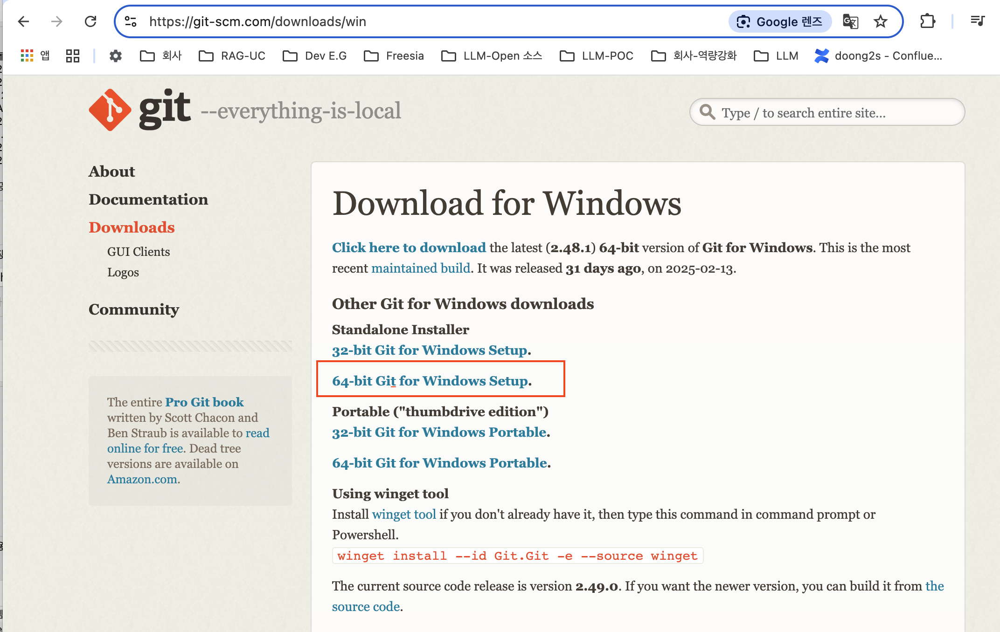
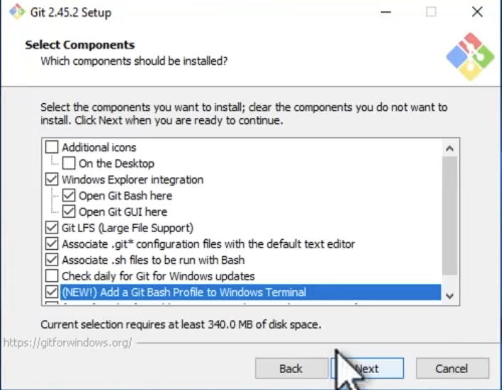
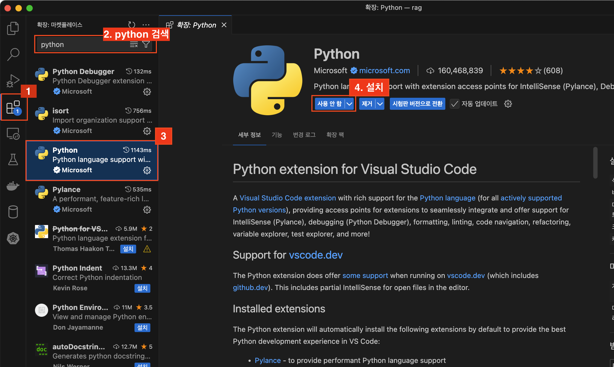
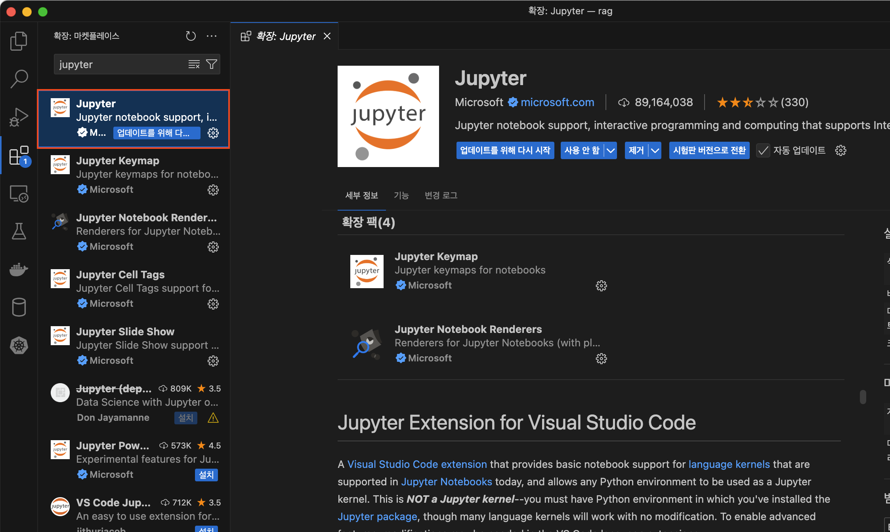

# 실습 환경 구성

## Windows 

### git 설치 
- 64-bit 윈도우 다운로드 : https://git-scm.com/downloads/win  



- 설치 옵션 추가 : (NEW)Add a Git Bash Profile to Windows Terminal



#### 설치 확인
윈도우 PowerShell 실행 (**반드시 관리자 권한으로 실행**)  
CMD 입력 : git 

### pyenv 설치
**윈도우 PowerShell 관리자 권한으로 실행**

- PowerShell 정책 설정
```PowerShell
Set-ExecutionPolicy RemoteSigned -Scope CurrentUser -Force
```

- 다운로드
```PowerShell
git clone https://github.com/pyenv-win/pyenv-win.git "$env:USERPROFILE\.pyenv"
```
- 환경변수 추가
```PowerShell
[System.Environment]::SetEnvironmentVariable('PYENV', $env:USERPROFILE + "\.pyenv\pyenv-win\", "User")
[System.Environment]::SetEnvironmentVariable('PYENV_ROOT', $env:USERPROFILE + "\.pyenv\pyenv-win\", "User")
[System.Environment]::SetEnvironmentVariable('PYENV_HOME', $env:USERPROFILE + "\.pyenv\pyenv-win\", "User")
```

```PowerShell
[System.Environment]::SetEnvironmentVariable('PATH', $env:USERPROFILE + "\.pyenv\pyenv-win\bin;" + $env:USERPROFILE + "\.pyenv\pyenv-win\shims;" + [System.Environment]::GetEnvironmentVariable('PATH', "User"), "User")
```

#### 설치 확인
- **PowerShell 종료 후 다시 실행**
```PowerShell
pyenv
```

### python 설치
- python 설치
```PowerShell
pyenv install 3.11.9
```

- python 버전 설정
```PowerShell
pyenv global 3.11.9
```

- python 버전 확인 : 3.11.9 
```PowerShell
python --version
```

### 실습 코드 다운로드
- 실습코드 링크 : https://github.com/yeongdeokcho/edu-rag

- 실습코드 다운로드 디렉토리 이동
```PowerShell
cd ~/Documents
```
- 실습 코드 다운로드
```PowerShell
git clone https://github.com/yeongdeokcho/edu-rag.git
```

### Poetry 설치
- python 가상환경 구성
```PowerShell
pip3 install poetry==1.8.5
```

- 작업 디렉토리 이동
```PowerShell
cd edu-rag
```

- 파이썬 가상환경 설정
```PowerShell
poetry shell
```

- 파이썬 패키지 일괄 업데이트
```PowerShell
poetry update
```

### VS Code 설치
- VS Code 다운로드 : https://code.visualstudio.com/download

- Extensions 설치
  - Python 설치 
    
  - Jupyter Notebook 설치
    

---

## MAC
- brew 설치
- git 설치
- xcode 설치

### python 설치
```bash
brew update
brew install pyenv

echo 'export PYENV_ROOT="$HOME/.pyenv"' >> ~.zshrc
echo '[[ -d $PYENV_ROOT/bin]] && export PATH="$PYENV_ROOT/bin:$PATH"' >> ~/.zshrc
ehco 'eval "$(pyenv init -)"' >> ~/.zshrc

exec "$SHELL"
```

### python 설치

```bash
pyenv install 3.11.9
pyenv gloval 3.11

```


### poetry 설치

```bash
pip3 install poetry
cd ~/Documents/rag-edu

# 파이선 가상환경 설정
poetry shell

# 패키지 일괄 업데이트
poetry update 

## 오류 : 수동 설치
pip install requirements.txt

```

### VS Code
 - VS Code 다운로드 설치


### LangSmith 가입
- https://smith.langchain.com/
- [LangSmith 추적 설정](https://wikidocs.net/250954)

### Upstage
- https://console.upstage.ai/

### HuggingFace
- https://huggingface.co
- 우측 상단 사용자 > 설정 > AccessToken

