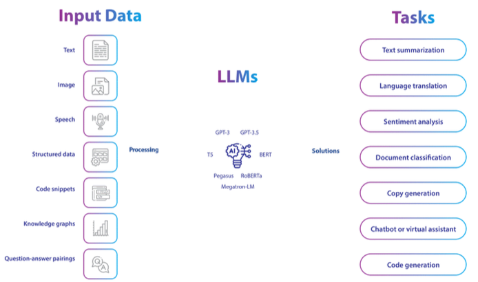
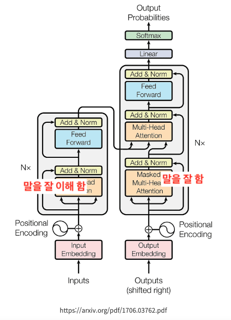
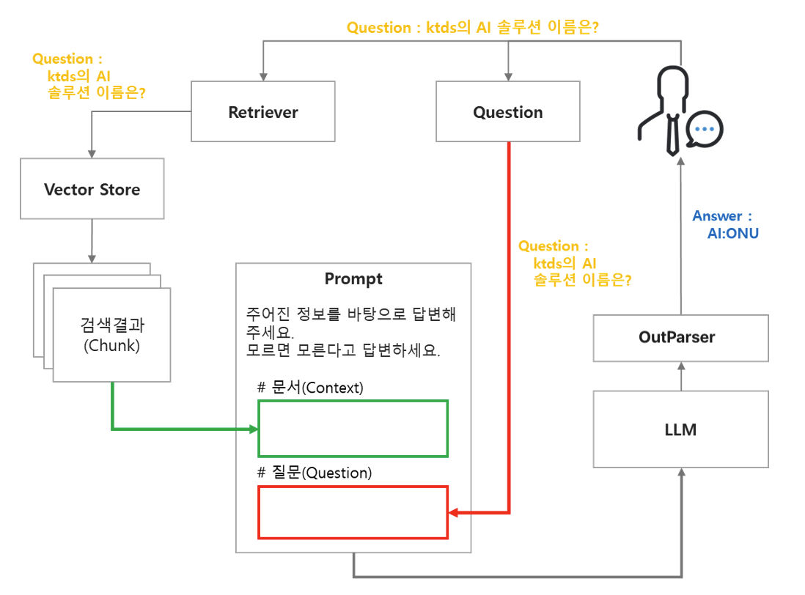
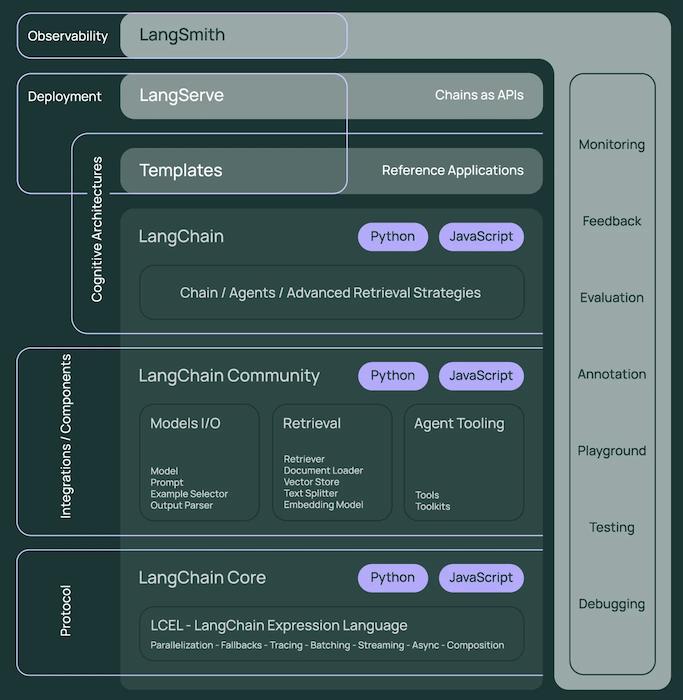

# LLM(초거대 언어 모델)의 이해

## LLM이란?
LLM(Large Language Model)은 방대한 양의 텍스트 데이터로 학습된 인공지능 모델로, 인간의 언어를 이해하고 생성할 수 있는 능력을 갖추고 있음  
GPT(Generative Pre-trained Transformer), Claude, Llama 등이 대표적인 예  

## Transformer의 인코더와 디코더
최근의 NLP(Natural Language Process) 모델의 대부분은 Transformer 아키텍처를 기반으로 하며,   
모델의 용도에 따라 Transformer의 Encoder, Decoder를 개별 또는 통합 사용하는 추세  

- 인코더 (Encoder)
  - 역할: 인코더는 입력된 문장의 정보를 전체적으로 이해  
    예, "나는 밥을 먹었다"라는 문장이 있으면, 인코더는 이 문장의 모든 단어들이 서로 어떻게 연결되고, 
    문장의 전체적인 의미와 맥락이 무엇인지를 파악  
  - 특징: 인코더는 먼저 각 단어를 벡터로 변환한 후, 각 단어들이 서로 어떻게 연결되는지 파악
    여러 번의 연산을 거치면, 문장의 의미를 더 깊고 정확하게 이해
- 디코더 (Decoder)
  - 역할: 출력 문장을 생성
    입력 문장을 처리한 후, 그에 맞는 출력을 하나씩 차례대로 만듦
  - 특징: 단어(토큰)를 하나씩 예측하면서 문장을 생성
    이전에 생성된 단어들을 바탕으로 다음 단어를 예측, 문장의 흐름이 자연스러움

## 작동 원리
- **사전 학습(Pre-training)**   
   인터넷, 책, 문서 등 광범위한 텍스트 데이터를 통해 언어의 패턴과 구조 학습
- **미세 조정(Fine-tuning)**  
   특정 목적에 맞게 추가 학습을 진행
- **추론(Inference)**   
   학습된 패턴을 기반으로 적절한 텍스트 생성

## 주요 특징
- **맥락 이해**: 대화의 흐름과 주제를 파악하여 적절한 응답 생성
- **다양한 작업 수행**: 번역, 요약, 창작, 코딩, 질의응답 등 다양한 언어 관련 작업 가능
- **지식 기반**: 학습 데이터를 통해 습득한 광범위한 지식 보유
- **지속적 발전**: 모델 크기, 학습 방법, 평가 지표 등이 계속 개선 중

## 활용 분야
- **교육**: 개인화된 학습 도우미, 교육 컨텐츠 생성
- **비즈니스**: 고객 서비스, 콘텐츠 생성, 데이터 분석
- **연구**: 정보 검색, 자료 요약, 아이디어 발굴
- **창작**: 글쓰기 지원, 아이디어 발전, 콘텐츠 제작

## 한계
- **사실 정확성**: 때로는 잘못된 정보를 생성할 수 있음 (환각 현상)
- **편향성**: 학습 데이터에 존재하는 편향이 결과물에 반영될 수 있음
- **윤리적 측면**: 콘텐츠 생성, 개인정보, 저작권 등 윤리적 문제 고려 필요
- **기술적 한계**: 최신 정보 부족, 특정 전문 분야 지식 한계
- **토큰 제한**: 입력값이 길어지면 계산량이 늘어나 토큰 제한 

--- 

# RAG(검색 증강 생성)의 이해

## RAG(Retrieval-Augmented Generation) 구조

### 사전작업(Pre-processing)
데이터 소스를 Vector DB에 지식을 생성하기 위해 문서를 로드-분할-임베딩-저장 하는 4단계

- 1단계 문서로드(Document Load): 문서 내용을 로딩
- 2단계 분할(Text Split): 문서를 특정 기준(Chunk) 으로 분할
- 3단계 임베딩(Embedding): 분할된(Chunk)를 벡터로 임베딩
- 4단계 벡터DB 저장: 임베딩된 Chunk를 DB에 저장

### RAG 수행(RunTime)
저장된 지식을 사용자 질의를 바탕으로 검색-프롬프트 생성-LLM 모델 정의-체인을 구성하는 4단계

- 5단계 검색기(Retriever): 
  - Query(사용자 질의)를 바탕으로 Vector Store(DB)에서 검색 결과를 가져오기 위한 리트리버 정의  
  - 리트리버는 검색 알고리즘으로 Dense(유사도 기반 검색), Sparse(키워드 기반 검색) 리트리버로 나눔
- 6단계 프롬프트: RAG를 수행하기 위해 문서에서 검색된 내용과 답변 형식 등으로 프롬프트 생성  
- 7단계 LLM: 모델 정의(GPT-3.5, GPT-4, Claude, etc..)
- 8단계 Chain: 프롬프트 - LLM - 출력에 이르는 체인 생성

### RAG 구조

## LangChain

### LangChain 이란?
- LLM을 활용한 애플리케이션 개발을 단순화하기 위해 설계된 오픈 소스 프레임워크 
- 다양한 LLM과 상호 작용하고 연결하여 복잡한 AI 애플리케이션을 쉽게 구축할 수 있게 도와주는 도구
- 잘 만들어진 LLM을 사용하여 텍스트 분석 기능, 챗봇, 추천 등 서비스 개발에 사용

### LangChain 구성 요소

---

## 참고 자료
- [LangChain] : [랭체인 LangChain 노트](https://wikidocs.net/book/14314)
- [LangChain 아키텍처] : [Langchain이란](https://velog.io/@pprriitt/Langchain-%EC%9D%B4%EB%9E%80)
- [실습코드] : [LangChain 한국어 튜토리얼](https://github.com/teddylee777/langchain-kr)

