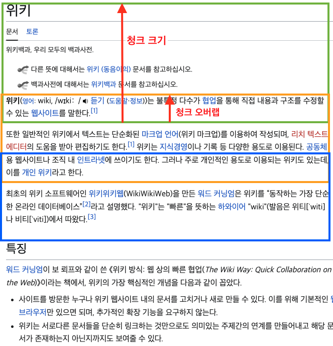

# 텍스트 분할(Text Splitter)

## 1. 텍스트 분할의 개념과 필요성

### 텍스트 분할이란?
- **정의**: 긴 문서를 의미 있는 작은 단위(청크)로 나누는 과정
- **목적**: 임베딩, 검색, 처리를 위한 적절한 크기의 텍스트 조각 생성

### 텍스트 분할의 필요성
- **컨텍스트 윈도우 제한**: LLM과 임베딩 모델은 입력 텍스트 길이 제한이 있음
- **검색 정확도**: 너무 큰 청크는 관련 없는 정보를 포함하고, 너무 작은 청크는 컨텍스트 부족
- **계산 효율성**: 적절한 크기의 청크는 임베딩 생성 및 검색 처리 효율성 향상
- **의미 단위 보존**: 문서의 의미론적 단위를 유지하여 검색 관련성 향상

### 잘못된 분할의 결과
- 의미 단절로 인한 정보 손실
- 검색 품질 저하
- 중복 정보 증가
- 처리 효율성 감소

### 문서 분할 과정
- **문서 구조 파악**
    - PDF 파일, 웹페이지, 전자책 등 다양한 형식의 문서에서 구조 파악
    - 헤더, 푸터, 페이지 번호, 섹션 제목 등을 식별
- **단위 선정**
    - 페이지별, 섹션별, 문단별 등 문서의 내용과 목적에 따라 분할 단위 결정
- **단위 크기 선정(chunk size)**
    - 문서를 몇 개의 토큰 단위로 나눌 것인지 정함
- **청크 오버랩(chunk overlap)**
    - 분할된 끝부분에서 맥락이 이어질 수 있도록 일부를 겹쳐서(overlap) 분할
  
### 청크 크기 & 청크 오버랩

---

## 2. 텍스트 분할의 주요 방법론

### 문자 기반 분할(Character-based Splitting)
- **원리**: 특정 문자 수를 기준으로 텍스트 분할
- **장점**: 구현 간단, 일관된 크기 보장
- **단점**: 문장이나 단락의 의미 단위 무시 가능성
- **사용 사례**: 균일한 크기의 청크가 필요한 경우, 단순 텍스트
- [문자/구분자 기반 분할 예제](./01-CharacterTextSplitter.ipynb)

### 구분자 기반 분할(Delimiter-based Splitting)
- **원리**: 특정 구분자(줄바꿈, 문장 부호 등)를 기준으로 텍스트 분할
- **장점**: 자연스러운 텍스트 경계 존중, 의미 보존 향상
- **단점**: 불균일한 청크 크기 가능성
- **사용 사례**: 구조화된 텍스트, 문단이 명확한 문서
- [문자/구분자 기반 분할 예제](./01-CharacterTextSplitter.ipynb)

### 재기적 분할(Recursive-Character-Splitting)
- **원리**: 구분자 계층 구조(단락("\n\n"), 줄("\n"), 문장(". "), 단어(" "), 문자(""))를 기준으로 텍스트 분할
- **장점**: 의미 단위 보존, 구분자와 청크 크기를 조정하여 다양한 문서 형식 지원
- **단점**: 재기적 처리 오버헤드
- **사용 사례**: 일반적인 텍스트 문서
- [재기적 분할 예제](./02-RecursiveCharacterTextSplitter.ipynb)

### 토큰 기반 분할(Token-based Splitting)
- **원리**: LLM 토큰화 방식을 고려하여 토큰 수 기준으로 분할
- **장점**: LLM 컨텍스트 윈도우에 최적화, 토큰 한계 준수
- **단점**: 토크나이저 의존성, 추가 계산 비용
- **사용 사례**: LLM과 직접 통합되는 시스템, 토큰 제한이 중요한 경우 
- [토큰 기반 분할 예제](./03-TokenTextSplitter.ipynb)
- 
### 의미 기반 분할(Semantic-based Splitting)
- **원리**: 텍스트의 의미 구조(문단, 섹션, 주제)를 기반으로 분할
- **장점**: 의미적 일관성 유지, 컨텍스트 보존
- **단점**: 구현 복잡, 언어 의존성
- **사용 사례**: 논문, 법률 문서, 기술 문서 등 구조화된 콘텐츠
- [의미 기반 분할 예제](./04-SemanticChunker.ipynb)

---

## 3. 효과적인 텍스트 청크 크기 결정

### 청크 크기의 중요성
- **검색 성능에 미치는 영향**: 청크 크기는 검색 정확도와 직접 관련됨
- **컨텍스트 보존과 특이성 간의 균형**: 큰 청크는 더 많은 컨텍스트를 포함하지만 특이성 감소

### 청크 크기 결정 요소
- **임베딩 모델 특성**: 모델이 처리할 수 있는 최적 텍스트 길이
- **문서 특성**: 문서의 구조, 밀도, 복잡성
- **검색 요구사항**: 필요한 정보의 세부성과 범위
- **질의 유형**: 예상되는 질문의 성격(사실적 vs 개념적)

---

## 4. 텍스트 분할 전략: 청크 중첩

### 중첩의 개념과 필요성
- **정의**: 인접한 청크 간에 일부 텍스트를 공유하는 방식
- **문제 해결**: 청크 경계에서 발생하는 컨텍스트 손실 방지
- **연속성 향상**: 청크 간 자연스러운 정보 흐름 유지

### 중첩 방식
- **고정 길이 중첩**: 모든 청크 간에 일정한 문자 수나 토큰 수 중첩
- **구분자 기반 중첩**: 문장이나 단락 단위로 중첩
- **비율 기반 중첩**: 청크 크기의 특정 비율(예: 10%, 20%)만큼 중첩

### 중첩 크기 선택
- **최소 중첩**: 청크 크기의 5-10%, 또는 1-2 문장
- **일반적 중첩**: 청크 크기의 10-20%, 또는 2-3 문장
- **높은 중첩**: 청크 크기의 20-30%, 중요한 컨텍스트 보존이 필요한 경우

### 중첩의 장단점
- **장점**
    - 컨텍스트 연속성 보장
    - 경계에 있는 정보 검색 가능성 향상
    - 문장과 단락의 완전성 유지

- **단점**
    - 저장 공간 증가
    - 중복 정보로 인한 검색 결과 중복 가능성
    - 임베딩 생성 및 검색 비용 증가
---

## 5. 특수한 문서 유형별 분할 전략

### 코드 및 기술 문서
- **방법**: 함수, 클래스, 섹션 경계를 존중하는 분할
- **구분자**: 들여쓰기, 주석 블록, 함수 정의
- **고려사항**: 코드 블록 완전성 유지, 참조 관계 보존
- [코드 기반 분할 예제](./05-CodeSplitter.ipynb)

### 논문 및 학술 문서
- **방법**: 논리적 섹션 경계를 존중하는 분할
- **구분자**: 헤딩, 참조, 인용
- **고려사항**: 인용 완전성, 수식, 참고문헌 처리

### 법률 문서
- **방법**: 법적 구조를 보존하는 분할
- **구분자**: 조항, 항목, 법적 단위
- **고려사항**: 법적 참조 완전성, 조항 간 관계 보존

### 대화 및 인터뷰 기록
- **방법**: 화자 턴을 존중하는 분할
- **구분자**: 화자 변경, 주제 변경
- **고려사항**: 대화 컨텍스트 유지, 화자 정보 보존

### 테이블 및 구조화된 데이터
- **방법**: 행 또는 열 단위 분할, 헤더 정보 보존
- **고려사항**: 헤더 반복, 관계 보존, 메타데이터 활용

---

## 6. 텍스트 분할과 의미 보존

### 의미 보존의 중요성
- 분할로 인한 정보 손실 최소화
- 검색 관련성 및 정확도 향상
- LLM 응답 품질 개선

### 의미 보존 전략
- **문맥 있는 경계 선택**
    - 문장, 단락, 섹션 경계에서 분할
    - 구문 분석기 활용하여 의미 단위 인식

- **참조 보존**
    - 대명사와 참조 대상 동일 청크에 유지
    - 상호 참조 정보 메타데이터로 저장

- **구조 보존**
    - 목록의 항목들 분리 금지
    - 표와 그래프의 완전성 유지

---

## 7. 메타데이터 관리와 텍스트 분할

### 분할 과정에서의 메타데이터 관리
- **원본 메타데이터 상속**: 원본 문서의 메타데이터를 모든 청크에 전달
- **위치 메타데이터 추가**: 문서 내 상대적 위치, 페이지 번호 등 추가
- **구조 메타데이터 추가**: 섹션 경로, 계층 구조 정보 추가

### 유용한 메타데이터 필드
- **기본 정보**: 원본 문서 ID, 제목, 저자, 날짜
- **위치 정보**: 페이지 번호, 청크 인덱스, 문단 번호
- **구조 정보**: 섹션 경로, 헤딩 계층
- **콘텐츠 정보**: 청크 길이, 단어 수, 토큰 수
- **관계 정보**: 이전/다음 청크 ID, 관련 청크 ID

---

## 8. 텍스트 분할 성능 평가 방법

### 분할 품질 평가 지표
- **청크 균일성**: 청크 크기의 표준 편차
- **경계 품질**: 문장이나 단락 절단 빈도
- **의미 보존**: 분할 전후의 임베딩 유사도
- **검색 성능**: 관련 정보 검색 정확도 및 완전성

### 검색 기반 평가 방법
- **질의-응답 평가**: 예상 질문 세트로 검색 정확도 측정
- **정보 검색 테스트**: 특정 정보 검색 성공률 측정
- **사용자 행동 분석**: 실제 사용자의 검색 만족도 측정

---

**참고 자료:**
- [실습코드] : [LangChain 한국어 튜토리얼](https://github.com/teddylee777/langchain-kr)
- LangChain 한국어 튜토리얼 : [CH07 텍스트 분할(Text Splitter) 참조](https://wikidocs.net/233776)
- LangChain 문서: [Text Splitters](https://python.langchain.com/docs/modules/data_connection/document_transformers/)
- HuggingFace 토크나이저 문서