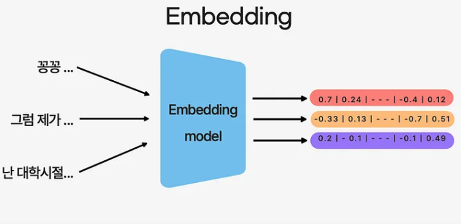
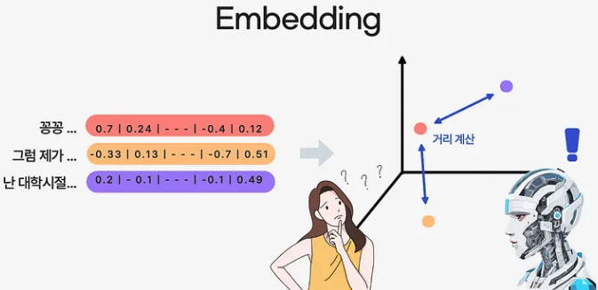
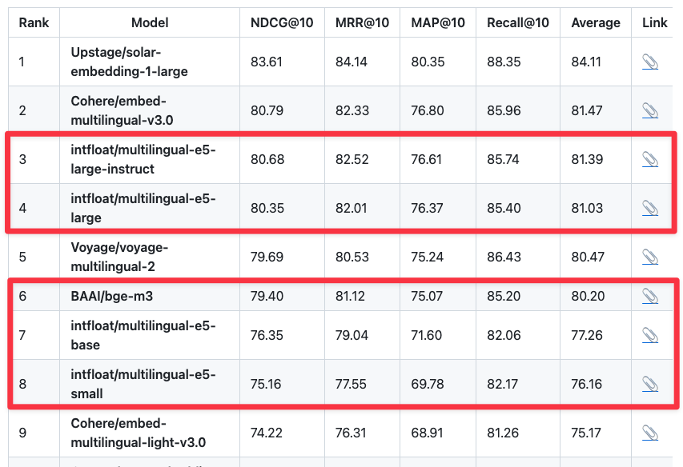
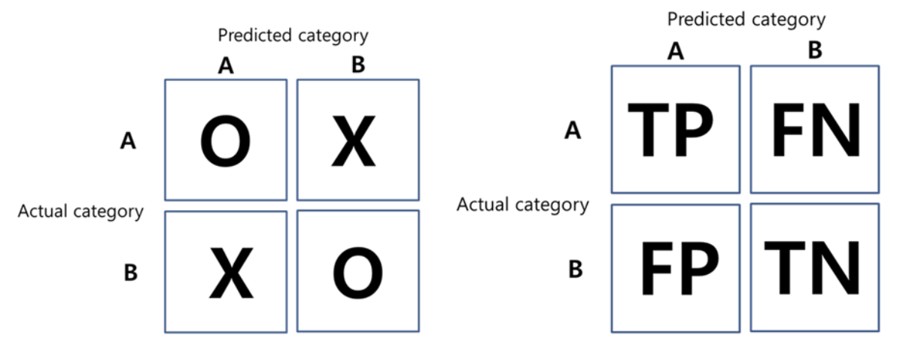
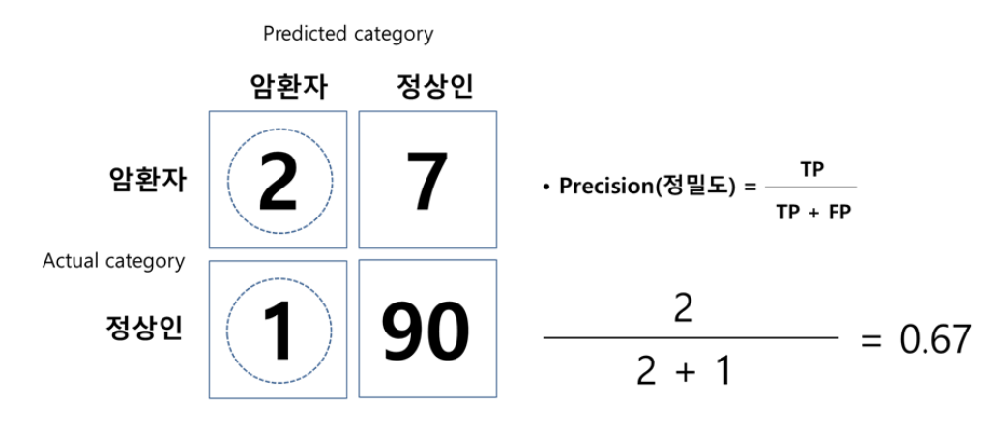
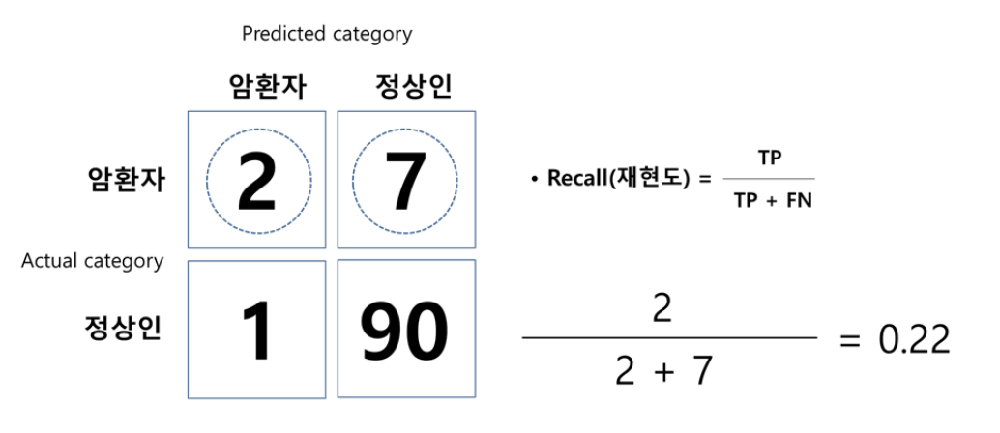
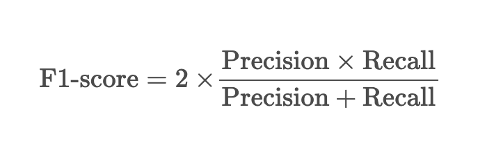

# 임베딩(Embedding)

## 1. 임베딩의 개념과 역할

### 임베딩이란?
- **정의**: 텍스트, 이미지 등의 비정형 데이터를 고정된 차원의 벡터(수치 배열)로 변환하는 과정
- **목적**: 의미적 유사성을 벡터 공간에서의 거리로 표현하여 기계가 처리할 수 있게 함


### 텍스트 임베딩의 기본 개념
- **벡터 표현**: 단어나 문장을 n차원 벡터(예: 768차원, 1536차원)로 변환
- **의미 캡처**: 유사한 의미를 가진 텍스트는 벡터 공간에서 서로 가까운 위치에 매핑됨
- **차원 축소**: 고차원의 언어 정보를 밀집된 벡터로 압축

### 임베딩의 핵심 특성
- **의미적 유사성 보존**: "고양이"와 "냥이"는 벡터 공간에서 가까움
- **문맥 인식**: 동일한 단어도 문맥에 따라 다른 벡터로 표현 가능
- **계산 가능성**: 코사인 유사도 등의 메트릭으로 텍스트 간 관계 계산 가능
- **차원 일관성**: 텍스트 길이와 관계없이 일정한 차원의 벡터 생성
  

### 임베딩 활용 사례
- **의미 검색(Semantic Search)**: 
  - 벡터 표현을 활용하여 의미적으로 유사한 텍스트를 검색하는 과정으로, 사용자가 입력한 쿼리에 대해 가장 관련성 높은 문서나 정보를 찾아내는 데 사용
- **문서 분류(Document Classification)**: 
  - 임베딩된 텍스트 벡터를 사용하여 문서를 특정 카테고리나 주제에 할당하는 분류 작업에 사용
- **텍스트 유사도 계산(Text Similarity Calculation)**:
    - 두 텍스트 벡터 사이의 거리를 계산하여, 텍스트 간의 유사성 정도를 정량적으로 평가  
---

## 2. 단어 임베딩과 문장/문서 임베딩

### 2.1. 단어(토큰) 임베딩(Word/Token Embedding)

**정의**: 개별 단어나 토큰을 벡터로 변환하는 방식

**동작 원리**:
- 원본 텍스트는 토크나이저(Tokenizer)에 의해 작은 단위(토큰)로 분할됨
- 각 토큰은 별도의 벡터로 표현됨
- 토큰은 단어 전체 또는 부분 단어(subword)가 될 수 있음

**주요 기법**:
- Word2Vec: 문장에서 단어와 주변 단어의 관계를 학습하여 단어를 벡터화
  - ex: "고양이는 귀엽다", "강아지도 귀엽다" -> 비슷한 문맥에서 사용, 고양이, 강아지 유사한 단어로 인식 
- GloVe: 단어가 얼마나 자주 같이 나오는지 학습
  - ex: 롯데리아라는 버거, 콜라, 감자튀김과 같이 등장하면 -> 롯데리아, 버거, 콜라, 감자튀김 유사한 단어로 인식
- FastText: 단어를 어려개 부분 단어 조각(n-gram)으로 쪼개서 학습
  - ex: **"사과"** 는 "사", "과", "사과" 등 따로 학습 -> 신규 단어 "사과주스"가 입력되어도 "사과"와 유사한 단어로 인식 

**장점**:
- 미세한 의미 차이 표현 가능
- 새로운 단어의 쉬운 통합
- 상대적으로 빠른 학습 및 추론 속도
- 계산 자원 요구량 적음

**단점**:
- 문맥 정보 반영 제한적
- 단어의 다의성(중의성) 처리 어려움
- 단어 순서나 문법적 관계 포착 제한적

**사용 사례**:
- 단어 유사도 분석
- 간단한 텍스트 분류
- 어휘 관계 모델링

### 2.2 문장/문서 임베딩(Sentence/Document Embedding)

**정의**: 문장이나 문서 전체를 하나의 벡터로 변환하는 기술

**동작 원리**:
- 문장/문서 내 모든 토큰의 임베딩을 계산
- 이들을 평균(averaging), 합산 또는 특수 알고리즘을 통해 단일 벡터로 통합
- 문맥 정보와 단어 간 관계를 포착하는 모델 구조 활용

**주요 기법**:
- Doc2Vec: Word2Vec의 문서 단위 확장 -> 문장, 문서를 하나의 벡터로 표시
- BERT/RoBERTa: 문장의 앞,뒤 문맥의 의미를 인식하여 벡터로 표시 -> 문장의 의미를 정확하게 파악
- Sentence-BERT: 문장을 벡터화하여 문장간 유사도 계산에 최적화된 BERT 변형

**장점**:
- 풍부한 문맥 정보 반영
- 단어 중의성(동음 이의어) 해소 가능
- 텍스트의 전체적 의미 포착 우수
- 복잡한 의미 관계 표현 가능

**단점**:
- 높은 계산 비용 및 자원 요구
- 실시간 처리의 어려움
- 긴 문서 처리 시 정보 손실 가능성
- 미세한 단어 수준 정보 희석 가능성


### 2.3 실제 적용 비교

#### 토크나이징 과정의 차이

**단어 임베딩**:
```
입력: "인공지능은 미래 기술이다"
토큰화: ["인공지능", "은", "미래", "기술", "이다"]
결과: 5개의 개별 벡터
```

**문장 임베딩**:
```
입력: "인공지능은 미래 기술이다"
내부 토큰화: ["인공지능", "은", "미래", "기술", "이다"]
결과: 하나의 통합된 벡터
```

### 2.4 RAG 시스템에서의 활용

**문장/문서 임베딩 적용**:
- 의미 기반 검색에 탁월하여 **주로 사용** 됨
- 복잡한 쿼리의 의도 파악에 우수
- 문맥 이해가 중요한 지식 기반 시스템에 적합

**단어 임베딩 적용**:
- 키워드 중심 검색에 효과적
- 특정 전문 용어나 엔티티 탐지에 유용
- 계산 효율성이 중요한 대규모 시스템에 적합

### 하이브리드 접근법

최신 RAG 시스템은 두 가지 임베딩 방식의 장점을 결합:

1. **키워드 + 의미 검색 결합**:
    - BM25와 같은 키워드 기반 검색(단어 임베딩 활용)
    - 의미 기반 검색(문장 임베딩 활용)
    - 두 결과의 앙상블로 최종 순위 결정

2. **계층적 임베딩**:
    - 1단계: 문서 임베딩으로 대략적 후보군 선정
    - 2단계: 단어 수준 임베딩으로 세부 관련성 평가

---

## 3. 임베딩 모델 제공자

### OpenAI
- GPT와 같은 언어 모델을 통해 텍스트의 임베딩 벡터를 생성할 수 있는 API를 제공
- 지원 모델

  | MODEL | PAGES PER DOLLAR | PERFORMANCE ON MTEB EVAL | MAX INPUT(토큰) |
  |---|---|---|---------------|
  | text-embedding-3-small | 62,500 | 62.3% | 8191          |
  | text-embedding-3-large | 9,615 | 64.6% | 8191          |
  | text-embedding-ada-002 | 12,500 | 61.0% | 8191          |
  - [MTEB EVAL(Massive Text Embedding Benchmark Evaluation)](https://introduce-ai.tistory.com/entry/%EC%9E%84%EB%B2%A0%EB%94%A9-%EB%AA%A8%EB%8D%B8-%ED%8F%89%EA%B0%80-MTEB-%EC%BD%94%EB%93%9C-%EC%82%B4%ED%8E%B4%EB%B3%B4%EA%B8%B0-1) 
    - 텍스트 임베딩 모델의 성능을 평가하기 위한 표준화된 벤치마크, 다양한 자연어 처리 작업에 걸쳐 임베딩 모델의 품질 측정
    - 표시된 백분율(예: text-embedding-3-small의 62.3%)은 해당 모델이 MTEB 벤치마크에서 달성한 종합 점수
    - Classification, Clustering, Pair similarity(쌍 유사도), Retrieval, Reranking, STS(Semantic Textual Similarity) 종합 평가
- [OpenAI 임베딩 예제](./01-OpenAIEmbeddings.ipynb)
    
### Hugging Face
- Transformers 라이브러리를 통해 다양한 오픈소스 임베딩 모델을 제공
- 한국어 지원 임베딩 모델 리더 보드

  - 참고 : [Kor-IR: 한국어 검색을 위한 임베딩 벤치마크](https://github.com/teddylee777/Kor-IR?tab=readme-ov-file) 

#### FlagEmbedding-BAAI/beg-m3 모델 
- FlagEmbedding은 BAAI(베이징 인공지능 연구소)에서 개발한 오픈소스 임베딩 모델 라이브러리
- BGE(BAAI General Embeddings) 시리즈 모델 활용하여 효율적인 정보 검색, 문서 임베딩, 의미 기반 유사도 검색 등 수행
- **특징**
  - 다양한 검색 방식 제공
  
    | 검색 방식                      | 설명                                                          |
    |----------------------------|-------------------------------------------------------------|
    | **Dense Retrieval**        | 의미기반 검색 -> 문장을 고정된 크기의 벡터로 변환하여 최근접 이웃 검색을 수행               |
    | **Sparse Retrieval**       | 키워드 기반 검색 -> 단어의 가중치를 고려하여 검색 성능을 개선 (BM25 등의 기법 활용)        |
    | **Multi-Vector Retrieval** | 문서 전체를 하나의 벡터로 변환하는 대신, 여러 의미 단위(문장,구,단락) 벡터로 분할하여 검색 성능 향상 |
    | **Hybrid Retrieval**       | Dense + Sparse 검색                                           |
  - 다국어 지원 : 100개 이상 언어 지원 
  - 성능 최적화를 위해 FP16(Half Precision Floating Point) 지원 : FP32 대비 2~8배 빠름
- [HuggingFace 임베딩 예제](./03-HuggingFaceEmbeddings.ipynb)

### Google
- Gemini, Gemma 등 언어 모델에 적용되는 임베딩 모델을 제공

### 기타
- Upstage, Ollama 등 임베딩 모델 제공
- [Upstage 임베딩 예제](./04-UpstageEmbeddings.ipynb)
- [Ollama 임베딩 예제](./05-OllamaEmbeddings.ipynb)

### 임베딩 메소드
- **embed_documents**: 
  - 문서 객체의 집합을 입력으로 받아, 각 문서를 벡터 공간에 임베딩
  - 주로 대량의 텍스트 데이터를 배치 단위로 처리할 때 사용
- **embed_query**: 
  - 단일 텍스트 쿼리를 입력으로 받아, 쿼리를 벡터 공간에 임베딩
  - 사용자의 검색 쿼리를 임베딩하여, 문서 집합 내에서 해당 쿼리와 유사한 내용을 찾아내는 데 사용
 
---

# 분류 성능 지표

## Confusion Matrix(혼동 행렬)
- 모델이 예측한 결과와 실제 결과를 비교하여 만들어지는 행렬

  - TP(True Positive) : 암 환자(관심 범주)를 암 환자로 예측 (예측 성공)
  - FP(False Positive) : 암 환자를 정상인으로 예측 (예측 실폐)
  - TN(True Negative) : 정상인을 정상인으로 예측 (예측 성공)
  - FN(False Negative) : 정상인을 암 환자로 예측 (예측 실폐) 

## Precision(정밀도)
- 암 환자로 예측한 결과(3명) 중 실제 암 환자인 사람(2명) 비율 : 67%
- **예측의 질에 대한 수치**
- 

## Recall(재현율)
- 실제 존재하는 암 환자(9명:TP+FN) 중 몇 명을 암 환자로 예측했는지(2명) 비율 : 22%
- **관심 범주가 아주 중요한 경우 실질적으로 더 의미 있는 지표**


## F1 Score
- **좋은 모델** : Precision(정밀도)과 Recall(재현율) 모두 좋아야 함
- 정밀도와 재현율을 동시에 확인 하는 지표
- 0 ~ 1 사이에 존재하는 값으로 **1에** 가까울수록 좋은 지표

---

**참고 자료:**
- [Medium] : [임베딩 깊이 파헤치기: RAG의 핵심 기술](https://medium.com/@minji.sql/임베딩-깊이-파헤치기-rag의-핵심-기술-6f077b8344e7)
- [실습코드] : [LangChain 한국어 튜토리얼](https://github.com/teddylee777/langchain-kr)
- LangChain 한국어 튜토리얼 : [2-4.RAG-Embedding 참조](https://wikidocs.net/231431)
- HuggingFace 토크나이저 문서

