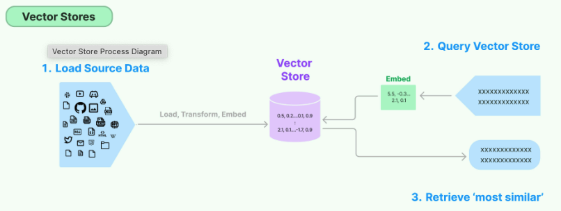

# 벡터스토어(Vector Store)
---

## 1. 벡터스토어의 개념과 중요성

### 벡터스토어란?
텍스트, 이미지 등의 데이터를 **벡터(임베딩)** 형태로 저장하고, 이들 간 **유사도 검색**을 효율적으로 수행하는 데이터베이스



[참고 : LangChain](https://python.langchain.com/v0.1/docs/modules/data_connection/vectorstores)

### 벡터스토어의 주요 기능
1. **벡터 저장**: 임베딩된 데이터를 효율적으로 저장
2. **유사도 검색**: 주어진 쿼리 벡터와 가장 유사한 벡터 검색
3. **메타데이터 관리**: 벡터와 함께 원본 데이터, 출처 등의 메타데이터 저장
4. **인덱싱**: 빠른 검색을 위한 벡터 인덱스 구축
5. **필터링**: 메타데이터 기반 검색 필터링

### 벡터스토어가 중요한 이유
- **검색 효율성**: 임베딩 벡터를 효과적으로 저장, 관리, 인덱싱하여 대량의 데이터 중 빠른 정보 검색 가능
- **의미 기반 검색**: 키워드가 아닌 사용자 질문과 의미 유사성 기반 검색 지원
- **확장성**: 데이터 증가에 따른 효율적인 확장 가능
- **RAG 품질**: 벡터스토어의 성능(?)이 RAG 시스템 전체 품질에 직접적 영향
  - 벡터스토어가 정확한 정보를 찾지 못하면 → RAG가 엉뚱한 답변을 할 가능성이 높아짐
  - 벡터스토어가 좋은 검색 결과를 제공하면 → RAG가 더 정확하고 유용한 답변을 생성함

---

## 2. 벡터스토어의 작동 원리

### 구성 요소 


### 벡터 저장 및 검색 프로세스


### 벡터 유사도 측정


---

## 3. 주요 벡터스토어


### 1. 클라우드 서비스형

#### Pinecone
- **특징**: 완전 관리형 벡터 데이터베이스 or 소스 공유형 존재
- **장점**: 확장성 우수, 간편한 설정, 높은 가용성, 실시간 데이터 수집 가능, 검색 지연 시간 짧음, LangChain 지원
- **단점**: 비용 부담, 데이터 위치 제한(AWS에서 한국 리전 지원 안됨. 개인정보 등 민감 정보 사용 못함 )

#### Weaviate 
- **특징**: 지식 그래프 기능이 통합된 벡터 데이터베이스  or 소스 공유형 존재
- **장점**: 다중 모달 지원, GraphQL 인터페이스, OpenAI, Cohere, HuggingFace 통합
- **단점**: 설정 복잡성, 초기 학습 곡선

#### Milvus
- **특징**: 대규모 벡터 검색 엔진
- **장점**: 높은 확장성, 다양한 인덱스 지원, 활발한 커뮤니티
- **단점**: 초기 설정 복잡성

#### Azure AI Search
- **특징**: 완전 관리형의 Azure 클라우드 기반 벡터 데이터베이스
- **장점**: 높은 확장성, 다양한 트래픽 지원, Azure AI의 타 서비스와 통합, 한국 리전 지원
- **단점**: 비용 부담

### 2. 기존 데이터베이스 확장형

#### PostgreSQL + pgvector
- **특징**: 관계형 DB에 벡터 기능 추가
- **장점**: 기존 PostgreSQL 활용, SQL 쿼리 통합, 익숙한 환경
- **단점**: 대규모 확장 제한적, 전문 벡터 DB 대비 성능 한계

#### Qdrant
- **특징**: 벡터 유사도 검색에 최적화된 오픈소스 DB
- **장점**: 고성능, 필터링 기능 강화, 간결한 API, 고차원 벡터 검색, 추천 같은 포괄적인 기능 제공
- **단점**: 상대적으로 신생 솔루션

#### Elasticsearch + kNN
- **특징**: 전문 검색 엔진에 벡터 검색 추가
- **장점**: 텍스트 검색과 벡터 검색 결합, 풍부한 생태계
- **단점**: 리소스 요구량 높음, 설정 복잡

### 3. 경량 및 임베디드 옵션

#### Chroma
- **특징**: Python 기반 경량 벡터 데이터베이스, LangChain 지원
- **장점**: 설치 간편, 빠른 시작, 개발 용이성
- **단점**: 대규모 확장성 제한, 초기 개발 단계

#### FAISS (Facebook AI Similarity Search)
- **특징**: 고성능 유사도 검색 라이브러리
- **장점**: 뛰어난 성능, 다양한 인덱스 지원, 메모리 최적화
- **단점**: 데이터베이스가 아닌 라이브러리, 지속성 관리 필요

| 인덱스 유형 | similarity_search 특성                                 | 사용 사례 |
|------------|------------------------------------------------------|-----------|
| IndexFlatL2 | - 완전 정확한 L2 거리 계산<br>- 모든 벡터와 비교(선형 검색)              | 작은 데이터셋, 높은 정확도 필요 |
| IndexFlatIP | - 내적 기반 유사도 계산<br>- 정규화된 벡터에서는 코사인 유사도와 동일           | 코사인 유사도 검색 |
| IndexIVFFlat | - 근사 검색으로 속도 향상<br>- `nprobe` 매개변수로 클러스터 검색 범위(수) 조절 | 중간 크기 데이터셋, 속도/정확도 균형 |
| IndexHNSWFlat | - 그래프 기반 빠른 검색<br>- 높은 정확도 유지                        | 빠른 검색 필요한 중대형 데이터셋 |
| IndexIVFPQ | - 크게 압축된 벡터 저장<br>- 메모리 효율적, 정확도 일부 손실               | 대규모 데이터셋, 메모리 제약 환경 |  
[참고 : Faiss indexes](https://github.com/facebookresearch/faiss/wiki/Faiss-indexes) 

---

## 4. 벡터 인덱스 알고리즘

### 인덱싱의 중요성
벡터 인덱스는 대규모 벡터 컬렉션에서 **효율적인 유사도 검색**을 가능하게 하는 핵심 요소  
적절한 인덱스 없는 경우 모든 벡터를 순차적으로 검사, 데이터셋 크기가 증가할수록 검색 시간이 선형적으로 증가

### 주요 벡터 인덱스 알고리즘
- 그래프 기반 인덱스: HNSW(Hierarchical Navigable Small-World)
- 역 인덱스 기반 인덱스: 역 파일 인덱스(InVerted File index, IVF)
- 해시함수 기반 인덱스(hash-based index): LSH(Locality Sensitive Hashing)
- 트리 기반 인덱스: ANNOY(Approximate Nearest Neighbors Oh Yeah)

#### 1. HNSW(Hierarchical Navigable Small World)
  
[참고 : 효율적인 벡터 검색 알고리즘 HNSW 알아보기](https://devocean.sk.com/blog/techBoardDetail.do?ID=167246&boardType=techBlog)
- **원리**: 계층적 그래프 구조로 벡터 공간 탐색
  - 멀티 레벨 그래프 구조: 데이터 포인트들을 여러 계층으로 나누어 저장하며, 상위 계층에서는 적은 수의 포인트만 유지
  - 근접 이웃 탐색 최적화: ‘작은 세계(Small World)’ 네트워크 구조를 활용하여 이웃 노드만 검색
  - 동적 업데이트 : 데이터 삽입 및 업데이트가 실시간으로 가능
- **특징**:
    - 높은 검색 정확도, 빠른 검색 속도
    - 메모리 사용량 많음
- **사용 예**: Qdrant, Weaviate, Elasticsearch kNN

#### 2. IVF(Inverted File Index)
  
[참고 : Similarity Search with IVFPQ](https://towardsdatascience.com/similarity-search-with-ivfpq-9c6348fd4db3/)
- **원리**: 벡터 공간을 클러스터로 나눠 검색 범위 축소
  - 데이터를 사전에 유사한 것들끼리 모아 몇 개의 군집으로 묶음(k-means(k-평균) 클러스터링)
  - 클러스터링 결과를 코드북(중심점 집합)과 코드워드(중심점에 해당하는 클러스터에 속한 데이터틀) 형태로 저장
- **특징**:
    - 적은 메모리 사용량 
    - 중간 수준의 검색 속도와 정확도
    - 데이터 분포에 민감
- **적합한 경우**: 대규모 데이터셋, 메모리 제약 있을 때
- **사용 예**: FAISS, Milvus

#### 3. PQ(Product Quantization)
  
[참고 : Product Quantization for Similarity Search](https://towardsdatascience.com/product-quantization-for-similarity-search-2f1f67c5fddd)
- **원리**: 고차원 벡터를 저차원 부분 벡터로 양자화하여 압축
  - 벡터 분할: 고차원 벡터를 여러 개의 하위 벡터(서브벡터)로 분할
  - 서브벡터를 미리 정의된 코드북의 가장 가까운 중심점(centroid)으로 대체
- **특징**:
    - 저장 공간 효율성 극대화
    - 압축으로 인한 정확도 손실
    - 검색 속도 향상
- **적합한 경우**: 초대규모 데이터셋, 저장 공간 제약 있을 때
- **사용 예**: FAISS, Milvus, Pinecone

# 다시 정리 : 영덕
https://itforfun.tistory.com/184 다시 정리

#### 4. Annoy(Approximate Nearest Neighbors Oh Yeah)
- **원리**: 무작위 투영을 통한 이진 트리 구성
- **특징**:
    - 메모리 사용량 적음
    - 정적 인덱스 (업데이트 제한적)
    - 준수한 검색 성능
- **적합한 경우**: 정적 데이터셋, 메모리 제약 있을 때
- **사용 예**: Spotify 추천 시스템


### 인덱스 선택 가이드라인

| 고려 사항 | HNSW | IVF | PQ | Annoy |
|------------|------|-----|----|----|
| 데이터셋 크기 | 중소규모 | 대규모 | 초대규모 | 중소규모 |
| 메모리 제약 | 높음 | 중간 | 낮음 | 낮음 |
| 검색 정확도 | 매우 높음 | 중간 | 낮음-중간 | 중간 |
| 검색 속도 | 매우 빠름 | 빠름 | 빠름 | 빠름 |
| 업데이트 용이성 | 가능 | 가능 | 제한적 | 제한적 |

---

## 5. 메타데이터 필터링과 하이브리드 검색

### 메타데이터의 중요성
메타데이터는 벡터와 함께 저장되는 부가 정보로, 검색 결과를 필터링하고 컨텍스트를 제공하는 데 중요한 역할을 함

### 유용한 메타데이터 유형
1. **소스 정보**: 원본 문서 경로, URL, 파일명
2. **시간 정보**: 생성일, 수정일, 인덱싱 일자
3. **구조 정보**: 섹션, 페이지 번호, 문단 ID
4. **분류 정보**: 카테고리, 태그, 주제
5. **품질 정보**: 신뢰도 점수, 중요도 등급

### 메타데이터 필터링
메타데이터 필터링은 벡터 유사도 검색과 함께 검색 결과를 제한하는 기능입니다.

```python
# 메타데이터 필터링 예시 (Pinecone)
results = index.query(
    vector=query_embedding,
    filter={
        "category": "finance",
        "date_range": {"gte": "2025-01-01", "lte": "2025-01-31"},
        "confidence_score": {"gte": 0.8}
    },
    top_k=5
)
```

### 필터링 성능 최적화
- **인덱싱**: 자주 필터링하는 메타데이터 필드에 인덱스 생성
- **데이터 모델링**: 효율적인 필터링을 위한 메타데이터 구조 설계
- **캐싱**: 반복적인 필터 쿼리 결과 캐싱

### 하이브리드 검색

#### 1. 벡터 + 키워드 검색
- **키워드 검색**(BM25 등)으로 정확한 용어 매칭
- **벡터 검색**으로 의미적 유사성 포착
- 두 결과의 순위를 조합하여 최종 결과 생성

```python
# 하이브리드 검색 예시 (Elasticsearch)
results = es.search(
    index="documents",
    body={
        "query": {
            "script_score": {
                "query": {
                    "bool": {
                        "must": [
                            {"match": {"content": "artificial intelligence"}}  # 키워드 검색
                        ]
                    }
                },
                "script": {
                    "source": "cosineSimilarity(params.query_vector, 'embedding') + 1.0",  # 벡터 검색
                    "params": {"query_vector": query_embedding}
                }
            }
        }
    }
)
```

#### 2. 벡터 + 필터 + 재순위
단계적 검색 파이프라인 구성:
1. 벡터 유사도로 후보군 검색
2. 메타데이터 필터로 후보 제한
3. 추가 알고리즘으로 결과 재순위화

#### 하이브리드 검색의 이점
- **정확도 향상**: 다양한 검색 방법의 장점 결합
- **컨텍스트 인식**: 메타데이터 활용으로 상황에 맞는 결과
- **강건성**: 단일 방법의 약점 보완

---

**참고 자료:**
- [실습코드] : [LangChain 한국어 튜토리얼](https://github.com/teddylee777/langchain-kr)
