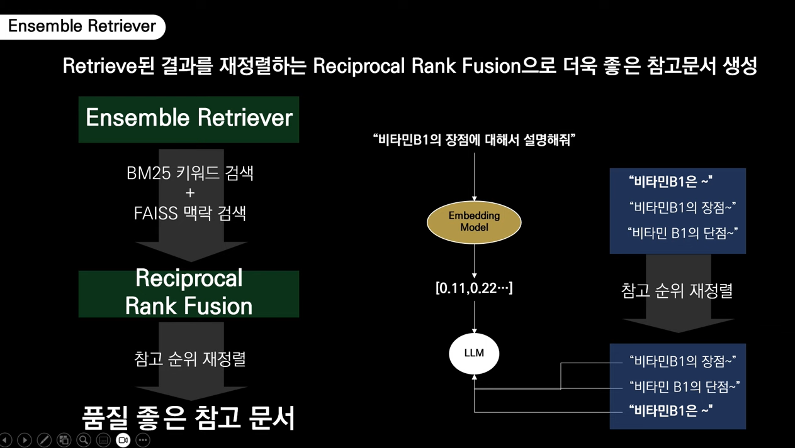
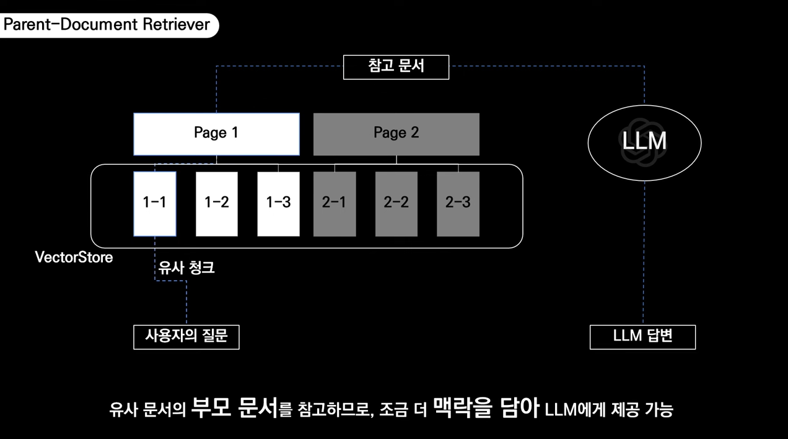

# 검색기(Retriever)

---

## 1. 검색기의 개념과 역할

### 검색기(Retriever)란?
사용자 질의와 관련된 정보를 지식 저장소에서 효과적으로 찾아내는 컴포넌트  
임베딩된 데이터가 저장된 벡터스토어에서 질의와 관련성이 높은 컨텍스트를 검색하는 역할을 담당

### 검색기의 주요 역할
1. **정확한 정보 제공**: 사용자 질의와 가장 관련성 높은 정보 검색
2. **컨텍스트 제공**: LLM에 전달할 적절한 컨텍스트 선별
3. **정보 필터링**: 불필요한 정보를 걸러내고 핵심 정보만 추출
4. **검색 최적화**: 속도, 정확도, 다양성 간의 균형 조정

### 검색기의 중요성
- **LLM 성능 좌우**: 검색의 품질이 최종 응답의 정확도를 결정
- **환각 현상 감소**: 관련성 높은 컨텍스트 제공으로 LLM의 환각 현상 감소
- **정보 최신성**: 최신 정보를 LLM에 제공하여 지식 한계 극복
- **도메인 특화**: 특정 분야에 대한 전문 지식 제공 가능

---

## 2. 검색기의 유형과 특징

### 2.1 Dense Retriever : 벡터 기반 검색기(Vector-based Retriever)
- **작동 원리**: 의미적 유사도를 기반으로 검색
- **주요 기술**: 임베딩 모델, 벡터 유사도 측정, ANN(Approximate Nearest Neighbor) 검색
- **장점**: 의미 검색 가능, 유사어/동의어 처리 가능
- **단점**: 정확한 키워드 매칭에 약함, 임베딩 품질에 의존적
- **예시**: DensePassageRetriever, ColBERT, SentenceTransformer

### 2.2 Sparse Retriever : 키워드 기반 검색기(Keyword-based Retriever)
- **작동 원리**: 텍스트 매칭과 통계적 관련성 기반 검색
- **주요 기술**: 
  - TF-IDF : 특정 문서 내에서 단어가 등장하는 빈도, 특정 단어가 전체 문서 집합에서 얼마나 희소한지(드문지) 측정 
  - BM25 : TF-IDF와 유사하게 문서 내 단어 등장 빈도, 문서 길이 정규화(길면 더 많은 단어 포함)
  - 인버티드 인덱스 : '단어 중심'으로 구성, 사전(Dictionary)에 단어가 포함된 문서 목록 포인터 저장
    ```
    단어A → [문서1, 문서3, 문서7, ...]
    단어B → [문서2, 문서4, 문서8, ...]
    ...
    ```
- **장점**: 정확한 키워드 매칭에 강함, 계산 효율성 높음
- **단점**: 동의어/유사어 처리 어려움, 의미적 유사성 파악 제한적
- **예시**: ElasticsearchRetriever, BM25Retriever, LexicalRetriever

### 2.3 하이브리드 검색기(Hybrid Retriever)
- **작동 원리**: 벡터 기반 + 키워드 기반 방식 결합
- **주요 기술**: 다중 검색 결과 병합, 재순위화(re-ranking)
- **장점**: 두 방식의 장점 결합, 더 높은 검색 정확도
- **단점**: 구현 복잡성, 계산 리소스 증가
- **예시**: MultiQueryRetriever, EnsembleRetriever

---

## 3. 작동 원리

### 3.1 기본 작동 프로세스
1. **쿼리 임베딩**: 사용자 질의를 벡터로 변환
2. **유사도 계산**: 쿼리 벡터와 문서 벡터 간 유사도 측정
3. **유사도 기반 순위화**: 유사도 점수에 따라 문서 순위 결정
4. **상위 k개 검색**: 가장 유사한 상위 k개 문서 반환

### 3.2 주요 유사도 측정 방법
- **코사인 유사도(Cosine Similarity)**: 
- **유클리드 거리(Euclidean Distance)**: 
- **내적(Dot Product)**:

### 3.3 검색 최적화 기법
- **ANN(Approximate Nearest Neighbor) 알고리즘**:
    - **HNSW(Hierarchical Navigable Small World)**: 계층적 그래프 기반 검색
    - **IVF(Inverted File Index)**: 벡터 공간을 클러스터로 분할
    - **PQ(Product Quantization)**: 벡터 압축으로 메모리 사용량 감소


---


## 5. 하이브리드 검색 전략

벡터 기반 검색과 키워드 기반 검색의 장점을 결합하여 더 높은 정확도와 다양성 제공

### 5.1 병렬 하이브리드 검색
- **접근 방식**: 벡터 검색과 키워드 검색을 동시에 실행
- **결과 처리**: 두 검색 결과를 병합하고 중복 제거
- **재순위화**: 결합된 결과를 재순위화하여 최종 순위 결정
- **장점**: 두 검색 방식의 장점 최대화, 더 다양한 관련 문서 검색

### 5.2 파이프라인 하이브리드 검색
- **접근 방식**: 한 검색 방식으로 초기 후보군 선정 후 다른 방식으로 재순위화
- **일반적 구현**: 키워드 검색(BM25) → 벡터 기반 재순위화
- **장점**: 계산 효율성 향상, 대규모 문서 집합에 효과적
- **사례**: ColBERT 모델의 다단계 검색

### 5.3 가중 결합(Weighted Combination)
- **접근 방식**: 두 검색 점수를 가중 평균하여 최종 점수 계산
  ```
  최종_점수 = α × 벡터_점수 + (1-α) × 키워드_점수
  ```
- **가중치 설정**: 도메인 특성과 쿼리 유형에 따라 조정
- **동적 가중치**: 쿼리 특성에 따라 자동으로 가중치 조정

### 5.4 쿼리 확장(Query Expansion)
- **접근 방식**: 원본 쿼리를 변형/확장하여 다양한 관련 문서 검색
- **구현 방법**:
    - 동의어 추가: 쿼리에 유사어 추가
    - 다중 쿼리 생성: LLM으로 다양한 형태의 쿼리 생성
    - 쿼리 분해: 복잡한 쿼리를 여러 단순 쿼리로 분해

---

## 5 검색기(Retriever)

### 5.1 벡터 스토어 기반 검색기(VectorStoreRetriever)  
vector store를 사용하여 문서를 검색하는 retriever **유사도 검색(similarity search)** 이나 **MMR** 같은 검색 메서드 사용
- **최대 마진 유사성(MMR, Maximum Marginal Relevance)**:  
  - 특정 쿼리에 대해 관련성이 높으면서도 서로 다양한 문서들을 선택하는 알고리즘  
  - 검색 결과의 다양성과 관련성 사이의 균형을 맞추려고 시도  
  ```
  MMR = λ × Sim(d, q) - (1-λ) × MaxSim(d, S)
  ```
  - Sim(d, q): 선택되지 않은 문서(d)와 쿼리 간 유사도 
  - MaxSim(d, S): 선택되지 않은 문서(d)와 이미 선택된 문서(S) 집합 간 최대 유사도
  - λ (lambda) : 관련성과 다양성 사이의 균형을 조절하는 파라미터 (0~1, 기본값: 0.5, 1: 유사도 점수만 고려, 0: 다양성만 고려)
  - **동작 원리**
    - 쿼리에 대해 관련성 높은 초기 문서 집합(R) 검색
    - 가장 관련성 높은 문서를 결과 집합(S)에 추가
    - 남은 각 후보 문서에 대해 MMR 점수 계산 : λ × Sim(d, q) - (1-λ) × MaxSim(d, S)
      - 의미 : 쿼리에 연관성 높은 문서 중 이미 선택된 문서와 유사한 문서 제외(댜양성 확보) 
    - 가장 높은 MMR 점수를 가진 문서를 결과 집합에 추가
    - 원하는 수의 문서를 선택할 때까지 3-4단계 반복  
    
[실습 : VectorStoreRetriever](./01-VectorStoreRetriever.ipynb)

### 5.2 문맥 압축 검색기(ContextualCompressionRetriever)
검색된 문서를 그대로 즉시 반환하는 대신, 주어진 질의의 맥락을 사용하여 문서를 압축함으로써 관련 정보만 반환
쿼리를 기본 검색기를 거쳐 초기 문서를 가져와 이를 문서 압축기(여러개 압축기로 파이프라인 구성)를 거쳐 관련성 높은 정보만 추출
- 기본 검색기(Base Retriever): 초기 문서 집합을 검색
- 문서 압축기(Document Compressor): 검색된 문서를 압축하거나 필터링

  ```
    # 1. 기본 검색기 설정
    base_retriever = db.as_retriever(search_kwargs={"k": 10})
  
    # 2. 문서 압축기 파이프라인 구성
    llm = ChatOpenAI(temperature=0, model="gpt-4o-mini")
  
    # 문자 기반 텍스트 분할기 필터 생성
    splitter = CharacterTextSplitter(chunk_size=300, chunk_overlap=0)
    # 임베딩을 사용하여 중복 제거 필터 생성
    redundant_filter = EmbeddingsRedundantFilter(embeddings=embeddings)
  
    pipeline_compressor = DocumentCompressorPipeline(
        # 문서 압축 파이프라인을 생성하고, 분할기, 중복 필터, 관련성 필터, LLMChainExtractor를 변환기로 설정합니다.
        transformers=[
            splitter,
            redundant_filter,
            relevant_filter,
            LLMChainExtractor.from_llm(llm),
        ]
    )  
  
    # 3. 문서 압축기 설정
    compression_retriever = ContextualCompressionRetriever(
        # 문서 압축기 파이프라인과 리트리버를 사용하여 컨텍스트 압축 리트리버 생성
        base_compressor=pipeline_compressor,
        base_retriever=retriever,
    )
    
    # 4. retriever 실행
    compressed_docs = compression_retriever.invoke(
        # 쿼리
        "Semantic Search 에 대해서 알려줘."
    )
  ```
[실습 : ContextualCompressionRetriever](./02-ContextualCompressionRetriever.ipynb)

### 5.3 앙상블 검색기(Ensemble Retriever)
여러 검색기를 조합하여 단일 검색기보다 더 뛰어난 검색 품질을 제공하는 방법


- **접근 방식**: 벡터 검색과 키워드 검색(BM25 주로 사용)을 동시에 실행
- **결과 처리**: 두 검색 결과를 병합하고 중복 제거
- **결과 재순위화**: 결합된 결과를 재순위화하여 최종 순위 결정

  ```
    # 1. BM25 retriever 설정
    bm25_retriever = BM25Retriever.from_texts(
        doc_list,
    )
    bm25_retriever.k = 1  # BM25Retriever 검색 결과 개수 1로 설정

    embedding = OpenAIEmbeddings()
    faiss_vectorstore = FAISS.from_texts(
        doc_list,
        embedding,
    )
  
    # 2. faiss retriever 설정
    faiss_retriever = faiss_vectorstore.as_retriever(search_kwargs={"k": 1})

    # 3. 앙상블 retriever 설정
    ensemble_retriever = EnsembleRetriever(
        retrievers=[bm25_retriever, faiss_retriever],
        weights=[0.7, 0.3],
    )
  ```
[실습 : EnsembleRetriever](./03-EnsembleRetriever.ipynb)

### 5.4 긴 문맥 재정렬(LongContextReorder)
모델이 긴 컨텍스트 중간에 있는 관련 정보에 접근해야 할 때, 제공된 문서를 무시하는 경향 있음  

[실습 : EnsembleRetriever](./04-LongContextReorder.ipynb)

### 5.5 상위 문서 검색기(ParentDocumentRetriever)
특정 질의에 대해 개별적인 문서(fragment)나 문서의 일부(segment)가 아닌, 해당 문서를 포함하고 있는 상위 문서(parent document) 전체 검색  

**문서 검색과 문서 분할의 균형**  
문서 검색 과정에서 문서를 적절한 크기 조각(청크)로 나누는 것은 **상충되는 두 가지 요소 고려**
- 작은 문서를 원하는 경우: 
  - 문서의 임베딩이 의미를 가장 정확하게 반영 
  - 문서가 너무 길면 임베딩이 의미를 잃어버릴 수 있음 
- 각 청크의 맥락이 유지되도록 충분히 긴 문서 원하는 경우



  ```
    # 부모 문서 생성하는 데 사용할 텍스트 분할기
    parent_splitter = RecursiveCharacterTextSplitter(chunk_size=1000)
    # 자식 문서를 생성하는 데 사용되는 텍스트 분할기
    # 부모보다 작은 문서 생성
    child_splitter = RecursiveCharacterTextSplitter(chunk_size=200)
    # 자식 청크를 인덱싱하는 데 사용할 벡터 저장소
    vectorstore = Chroma(
        collection_name="split_parents", embedding_function=OpenAIEmbeddings()
    )
    # 부모 문서의 저장 계층
    store = InMemoryStore()
    
    retriever = ParentDocumentRetriever(
        vectorstore=vectorstore,         # 벡터 저장소 지정
        docstore=store,                  # 문서 저장소 지정
        child_splitter=child_splitter,   # 하위 문서 분할기 지정
        parent_splitter=parent_splitter, # 상위 문서 분할기 지정
    )
    retriever.add_documents(docs)        # 문서를 retriever에 추가
    sub_docs = vectorstore.similarity_search("Word2Vec")  # 유사도 검색
  ```
[실습 : ParentDocumentRetriever](./05-ParentDocumentRetriever.ipynb)

### 5.6 다중 쿼리 검색기(MultiQueryRetriever)
하나의 질의(Query)를 다양한 방식으로 변형하여 여러 개의 질의를 생성하고, 이를 통해 검색 또는 정보 추출 성능을 향상시키는 방법

- 사용자 질문
  - 삼성전자 갤럭시 S24는 어떨 예정이야?
- **Multi-Query Retriever**:
  - 삼성전자 갤럭시 S24의 출시일은 언제인가요?
  - 삼성 갤럭시 S24의 기능과 사양은 어떻게 되나요?
  - 삼성 갤럭시 S24의 가격과 구매 가능 여부는 어떻게 되나요?  
  ```
    # ChatOpenAI 언어 모델, temperature는 0 설정
    llm = ChatOpenAI(temperature=0, model="gpt-4o-mini")

    # MultiQueryRetriever 언어 모델 사용하여 초기화
    multiquery_retriever = MultiQueryRetriever.from_llm(
          # 벡터 데이터베이스의 retriever와 언어 모델을 전달합니다.
        retriever=db.as_retriever(),
        llm=llm,
    )

    # 질문 정의
    question = "OpenAI Assistant API의 Functions 사용법에 대해 알려주세요."
    # 문서 검색
    relevant_docs = multiquery_retriever.invoke(question)
  ```  
[참고 : MultiQueryRetriever](./06-MultiQueryRetriever.ipynb)

### 5.7 셀프 쿼리 검색기(SelfQueryRetriever)
사용자의 초기 질의를 바탕으로 LLM이 스스로 추가적인 관련 질의를 만들어 저장된 문서의 내용과 의미적으로 비교
사용자의 질의에서 문서의 메타데이터에 대한 필터를 추출하고, 이 필터를 실행하여 관련된 문서를 검색


#### 셀프 쿼리 검색기(SelfQueryRetriever) Vs 다중 쿼리 검색기(MultiQueryRetriever)

- **동작 방식 비교**

| 특성 | SelfQueryRetriever | MultiQueryRetriever |
|------|-------------------|-------------------|
| 핵심 아이디어 | 자연어 쿼리를 구조화된 쿼리와 필터로 분해 | 하나의 쿼리에서 여러 변형 쿼리 생성 |
| 처리 방식 | 1. 자연어 쿼리 입력<br>2. LLM으로 쿼리와 필터로 분해<br>3. 벡터 검색 + 메타데이터 필터링<br>4. 필터링된 관련 문서 반환 | 1. 자연어 쿼리 입력<br>2. LLM으로 다양한 쿼리 변형 생성<br>3. 각 쿼리로 개별 검색 수행<br>4. 결과 병합 및 중복 제거 후 반환 |
| 사용 기술 | 메타데이터 필터링 + 벡터 검색 | 쿼리 확장 + 벡터 검색 |
| 처리 예시 | "2023년 AI 관련 보고서" → <br>쿼리: "AI 보고서", 필터: year=2023 | "AI가 일자리에 미치는 영향" → <br>변형1: "인공지능이 고용에 미치는 영향"<br>변형2: "자동화 기술과 노동 시장의 관계"<br>변형3: "AI로 인한 직업 대체 현상" |

- **장단점 비교**

| 특성 | SelfQueryRetriever | MultiQueryRetriever |
|------|-------------------|-------------------|
| 장점 | • 정확한 메타데이터 필터링 가능<br>• 복잡한 조건 검색에 효과적<br>• 메타데이터 활용으로 정밀도 향상<br>• 구조화된 데이터에서 강력한 성능 | • 검색 커버리지 확장<br>• 다양한 표현을 통한 재현율 증가<br>• 모호한 질문에 더 효과적<br>• 복잡한 개념 검색에 유리 |
| 단점 | • 구조화된 메타데이터 필요<br>• 표현의 다양성 부족<br>• 비정형 데이터에 제한적<br>• 메타데이터 스키마 정의 필요 | • 여러 쿼리로 인한 계산 비용 증가<br>• 결과 품질 일관성이 부족할 수 있음<br>• LLM 호출 증가로 지연 시간 증가<br>• 필터링 기능이 제한적 |
| 적합한 사용 사례 | • 구조화된 데이터베이스 검색<br>• 날짜, 저자 등 특정 속성으로 필터링<br>• 정확한 검색 결과가 필요한 경우<br>• 예: "2021년 미국에서 발표된 논문" | • 개념적이거나 추상적인 질문<br>• 다양한 측면에서 정보가 필요한 경우<br>• 포괄적인 검색 결과가 필요한 경우<br>• 예: "기후변화 대응 방안" |

[실습 : SelfQueryRetriever](./08-SelfQueryRetriever.ipynb)

### 5.8 다중 벡터저장소 검색기(MultiVectorRetriever)
문서를 여러 벡터로 저장하고 다양한 상황에서 효율적으로 쿼리하여, 검색의 정확도와 효율성 대폭 향상

**문서당 여러 벡터 생성 방법**
- **작은 청크 생성**:  
   문서를 더 작은 단위로 나눈 후, 각 청크에 대해 별도 임베딩 생성. 문서의 특정 부분을 잘 표현하는 벡터 생성  
   이 과정은 `ParentDocumentRetriever`를 통해 구현할 수 있어, 세부 정보에 대한 탐색 용이
- **요약 임베딩**:  
   각 문서를 요약하고 이 요약을 임베딩으로 생성. 요약 임베딩은 문서의 핵심 내용을 신속하게 파악 
   문서 전체를 분석하는 대신 핵심적인 요약 부분만을 활용하여 효율성 극대화
- **가설 질문 활용**:  
   각 문서에 대해 적합한 가설 질문을 만들고, 이 질문에 기반한 임베딩 생성(특정 주제나 내용에 대해 깊이 있는 탐색 시 사용)
   가설 질문은 문서의 내용을 다양한 관점에서 접근하게 해주며, 더 광범위한 이해를 가능하게 함
- **수동 추가 방식**:  
   사용자가 문서 검색 시 고려해야 할 특정 질문이나 쿼리를 직접 추가(사용자는 검색 과정에서 보다 세밀한 제어)
 
[실습 : MultiVectorRetriever](./07-MultiVectorRetriever.ipynb)

### 5.9 시간 가중 벡터저장소 검색기(TimeWeightedVectorStoreRetriever)
문서의 생성 시간을 고려하여 검색 결과에 가중치를 부여하는 검색 메커니즘
최신 정보에 더 높은 우선순위를 두고자 할 때 특히 유용


- decay_rate(감쇠율)
  - 시간 경과에 따른 문서 관련성 감소 가중치(0~1 사이, 1에 가까울수록 최신 문서)
  - 객체가 생성된 이후가 아니라 **마지막으로 액세스된 이후 경과된 시간** 
- hour_passed(경과 시간)
  - 문서가 생성된 이후 현재까지 경과한 시간(시간 단위) : (현재 시간 - 문서 생성 시간) / 3600초 

[실습 : TimeWeightedVectorStoreRetriever](./09-TimeWeightedVectorStoreRetriever.ipynb)

### 5.10 한글 형태소 분석기와 BM25Retriever 의 결합
한국어 텍스트 검색의 정확도와 성능을 크게 향상 위해서 한글 형태소 분석기 적용

- 형태소 분석기
  - [kiwipiepy 프로젝트 링크](https://github.com/bab2min/kiwipiepy)
  - [Okt](https://github.com/open-korean-text/open-korean-text)
  - [konlpy](https://konlpy.org/ko/latest/index.html)

[실습 : 한글 형태소 분석기+BM25](./10-Kiwi-BM25Retriever.ipynb)

---

**참고 자료:**
- [Data/AI Science] : [Langchain RAG 기법](https://velog.io/@sobit/Langchain-RAG-%EA%B8%B0%EB%B2%95)
- [실전! RAG 고급 기법] : [Retriever](https://www.youtube.com/watch?v=J2AsmUODBak&t=1763s)
- [실전! RAG 고급 기법] : [Retriever](https://www.youtube.com/watch?v=ehP4vphl_Us)
- [실습코드] : [LangChain 한국어 튜토리얼](https://github.com/teddylee777/langchain-kr)