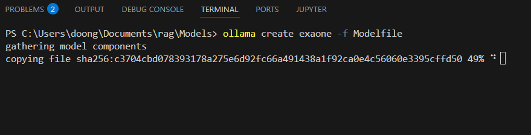

# ollama 서빙(로컬 모델 서빙)

Ollama LLM 사용 실습코드 확인 : [실습코드](./09-Ollama.ipynb)
## 설치파일 다운로드
- [설치파일]-[https://ollama.com/download](https://ollama.com/download)
- 설치

- 설치 확인
```shell

ollama
```


## 모델 다운로드
- GGUF 형식 모델 다운로드 
- 대상 모델 : [LG AI 연구소 LGAI-EXAONE/EXAONE-Deep-7.8B-GGUF](https://huggingface.co/LGAI-EXAONE/EXAONE-Deep-7.8B-GGUF/tree/main) 
  - Hugging Face 직접 다운로드 : EXAONE-Deep-7.8B-Q8_0.gguf 선택 후 다운로드
  
  - ollama 커맨드로 다운로드


## 모델 등록
- 경로 : ./models로 GGUF 파일 이동
- Modelfile(모델 기본 사항 정의 파일) 생성
  - 기본 모델 지정: 어떤 기본 모델(예: exaone, llama3, mistral 등)을 사용할지 정의
  - 시스템 프롬프트 설정: 모델의 성격, 응답 스타일, 제한사항 등을 정의하는 시스템 프롬프트를 설정
  - 템플릿 정의: 사용자 입력과 모델 출력의 포맷을 정의하는 템플릿을 설정
  - 매개변수 조정: temperature, top_p, top_k 등 모델의 추론 매개변수 조정
```
# Modelfile 내용
# Model path (choose appropriate GGUF weights on your own)
FROM ./EXAONE-Deep-7.8B-Q8_0.gguf

# Parameter values
PARAMETER stop "[|endofturn|]"
PARAMETER repeat_penalty 1.0
PARAMETER num_ctx 32768
PARAMETER temperature 0.6
PARAMETER top_p 0.95

# Chat template
#   Note: currently there is no feature of removing `<thought></thought>` steps from context 
#   because ollama does not support yet. We will update when according feature is available.
TEMPLATE """{{- range $i, $_ := .Messages }}
{{- $last := eq (len (slice $.Messages $i)) 1 -}}
{{ if eq .Role "system" }}[|system|]{{ .Content }}[|endofturn|]
{{ continue }}
{{ else if eq .Role "user" }}[|user|]{{ .Content }}
{{ else if eq .Role "assistant" }}[|assistant|]{{ .Content }}[|endofturn|]
{{ end }}
{{- if and (ne .Role "assistant") $last }}[|assistant|]<thought>
{{ end }}
{{- end -}}"""

# System prompt
SYSTEM """"""

# License
LICENSE """EXAONE AI Model License Agreement 1.1 - NC """
```
 
## 모델 등록
- Modelfile이 있는 위치에서 아래 명령어 실행하여 모델 등록

```sh

ollama create exaone -f Modelfile
```


## 모델 서빙(실행)
- Modelfile이 있는 위치에서 아래 명령어 exaone 모델 로컬 서빙

```sh

ollama run exaone
```


[실습코드-Ollama LLM 사용](./09-Ollama.ipynb)

## 모델 실행 중지

```sh

ollama stop exaone
```

---
## 참고 자료
- [LG AI EXAONE Deep 모델] : [Exaone 모델 등록 및 서빙](https://github.com/LG-AI-EXAONE/EXAONE-Deep)

