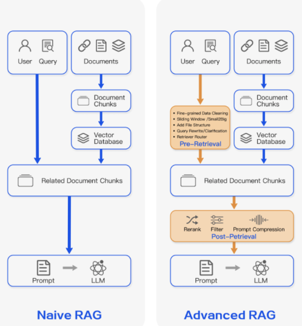
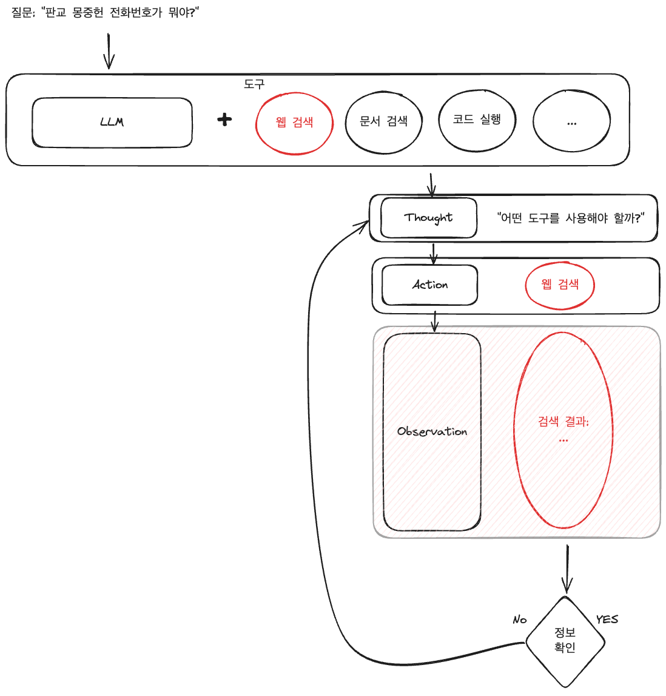

# Agentic RAG

## Naive RAG와 Advanced RAG

### Naive RAG (기본 RAG)  
- 사용자 쿼리와 관련된 문서를 단순 검색하여 LLM의 컨텍스트에 추가하는 방식  
- 단일 검색 단계와 고정된 파이프라인으로 구성되며 기본적인 임베딩 기반 유사도 검색을 활용

### Advanced RAG (고급 RAG)  
- 기본 RAG를 개선하여 계층적 인덱싱, 하이브리드 검색, 재순위화 등 더 정교한 검색 기술 적용  
- 컨텍스트 압축, 맥락 요약, 다단계 검색 등의 기법을 활용하여 검색 정확도와 응답 품질 향상

## Naive RAG와 Advanced RAG 시스템 한계

### Naive RAG의 한계점

#### 단순 검색 메커니즘의 한계
- **키워드 불일치 문제**: 의미적으로 관련이 있지만 동일한 키워드를 사용하지 않는 문서를 검색하지 못함
- **맥락 이해 부족**: 쿼리의 의도나 맥락을 충분히 고려하지 않고 표면적 유사성만 고려
- **동의어/유의어 처리 부족**: 같은 개념을 다른 용어로 표현한 문서를 적절히 검색하지 못함

#### 고정된 컨텍스트 처리
- **컨텍스트 창 제한**: LLM의 제한된 컨텍스트 창으로 인해 많은 정보를 처리할 수 없음
- **관련성 무시**: 검색된 모든 문서를 동일한 기준으로 처리하여 핵심 정보가 희석될 수 있음
- **정보 과부하**: 너무 많은 관련 없는 정보가 포함되어 모델의 응답 품질 저하

#### 단일 검색 사이클
- **복잡한 쿼리 분해 불가**: 여러 부분으로 구성된 복잡한 질문에 적절한 대응을 하지 못함
- **점진적 정보 수집 불가**: 초기 검색 결과를 바탕으로 추가 검색 불가
- **대화 맥락 유지 어려움**: 이전 대화의 정보를 효과적으로 활용하지 못함

#### 품질 관리 메커니즘 부재
- **검색 결과 검증 부족**: 검색된 정보의 정확성이나 신뢰성 평가 어려움
- **환각(Hallucination) 위험**: 검색된 정보가 부정확하거나 불충분할 때 LLM이 잘못된 정보 생성
- **자체 평가 능력 부재**: 생성된 응답의 품질 평가 기법은 다수 있으나 평가 신뢰도 확보 어려움 

### Advanced RAG의 한계점

#### 복잡성 증가
- **구현 난이도**: 다양한 고급 기술을 통합하기 위한 복잡한 아키텍처 필요
- **튜닝 어려움**: 여러 구성 요소의 최적 매개변수 조합을 찾기 어려움
- **유지보수 부담**: 복잡한 시스템으로 인한 디버깅 및 유지보수 어려움

#### 계산 리소스 요구
- **높은 컴퓨팅 비용**: 다단계 검색, 재순위화 등이 추가 계산 리소스 필요
- **실시간 처리 어려움**: 고급 처리 단계(Rerank 등)로 인한 응답 지연 발생 가능
- **확장성 문제**: 대규모 데이터셋에서 모든 고급 기능 유지 어려움

#### 기술적 제약
- **도메인 의존성**: 특정 도메인에 최적화된 기술이 다른 도메인에서 효과적이지 않을 수 있음
- **데이터 품질 의존**: 기본 데이터의 품질 문제를 완전히 해결하지 못함
- **모델 한계 상속**: 기반 LLM의 근본적 한계(편향, 환각 등)를 완전히 해결하지 못함

### 자율성 부족
- **제한된 적응성**: 미리 정의된 파이프라인으로 인한 예상치 못한 상황 대응 어려움
- **추론 능력 제한**: 검색된 정보를 넘어선 복합적 추론 능력 부족
- **능동적 정보 탐색 부족**: 자율적으로 정보 필요성을 판단하고 탐색하는 능력 제한

---

##  Agentic RAG의 개념과 기본 원리

###  Agentic RAG란?
- 기존 RAG 시스템에 자율적 에이전트의 의사결정 능력을 결합한 진화된 형태의 시스템  
- LLM(Large Language Model) 기반 에이전트가 Retrieval 프로세스를 능동적으로 계획, 실행, 
Retrieval 결과를 평가하고 통합하는 전 과정을 자율적으로 관리
- LLM + Tool(도구)의 조합 (ex : 웹검색, 문서검색, 코드실행, DB검색 등)

### Tool(도구)
#### Build-in Tools
- 에이전트, 체인 또는 LLM이 외부 세계와 상호작용하기 위한 인터페이스
- LangChain에서 제공하는 기본 도구를 사용하여 쉽게 기능 구현, 사용자 정의 도구 구축
- [LangChain 통합된 도구](https://python.langchain.com/docs/integrations/tools/#all-tools)
  - ex: 파이썬 실행(python REPL), 웹 검색 도구, 이미지 생성(DallE) 도구 등 5개 영역 빌드인 도구  
    이를 위해서는 `langchain.tools` 모듈에서 제공하는 `tool` 데코레이터를 사용하여 함수를 도구로 변환합니다.

#### Custom Tool
- 사용자가 직접 정의하여 사용하는 도구
- langchain.tools 모듈에서 제공한 tool 데코레이터 사용하여 함수를 도구로 변환
- @tool 데코레이터
  - 함수 위에 @tool 데코레이터 표기 
- Docstring을 사용해 함수, 클래스, 모듈 등의 역할 설명 (한국어 보다 영어 권고)
  - LLN에서 사용자 요청 처리에 필요 시  클래스, 함수 설명을 참고하여 실행   
  - 독스트링 예시 : """" """, ** **, ''' ''' 등 

[실습 : Build-in/Custom Tool](./01-Tools.ipynb)

###  기존 RAG와의 차이점
| 특성 | 기존 RAG | Agentic RAG |
|------|---------|------------|
| 작동 방식 | 미리 정의된 파이프라인 | 자율적 의사결정 |
| 검색 과정 | 단일 또는 정해진 다단계 검색 | 동적으로 결정되는 다단계 검색 |
| 적응성 | 제한적 (설계 시 결정) | 높음 (실시간 상황 대응) |
| 추론 능력 | 제한적 | 인간과 유사한 복합 추론 |
| 도구 활용 | 고정된 도구 세트 | 상황에 맞는 도구 선택 및 활용 |

###  Agentic RAG의 핵심 구성요소
- **에이전트 시스템**: LLM 기반 의사결정 엔진
- **도구 라이브러리**: 검색, 요약, 분석 등 다양한 기능의 도구(Tools)
- **메모리 시스템**: 대화 및 작업 맥락을 유지하는 단기/장기 메모리
- **계획 모듈**: 복잡한 작업을 단계별로 분해하고 계획하는 기능
- **자체 평가 시스템**: 결과의 품질과 관련성을 평가하는 기능

##  Agentic RAG의 작동 방식

###  기본 워크플로우
- **작업 이해**: 사용자 질의를 분석하고 목표 설정
- **계획 수립**: 필요한 정보와 접근 방법 결정
- **도구 선택 및 실행**: 적절한 검색 도구와 쿼리 방식 선택
- **결과 평가**: 검색된 정보의 관련성과 품질 평가
- **추가 행동 결정**: 더 많은 정보가 필요한지, 다른 접근이 필요한지 판단
- **응답 생성**: 검색된 정보를 통합하여 최종 응답 생성

**참고 자료:**
- [Data/AI Science] : [Langchain RAG 기법](https://velog.io/@sobit/Langchain-RAG-%EA%B8%B0%EB%B2%95)
- [실습코드] : [LangChain 한국어 튜토리얼](https://github.com/teddylee777/langchain-kr)
