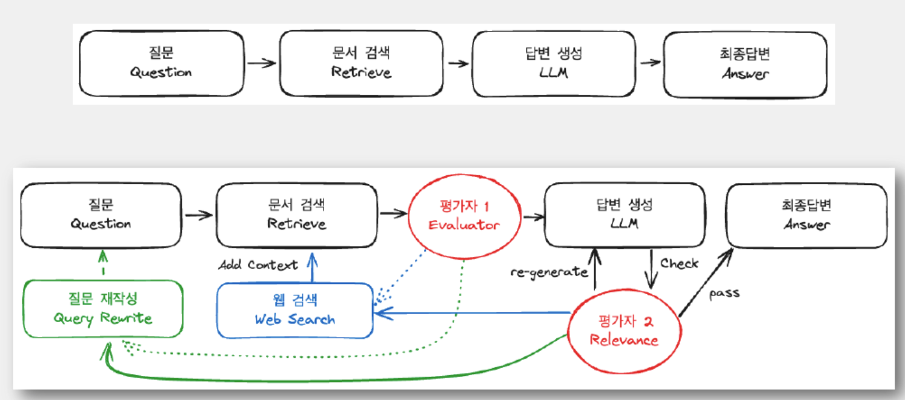

# LangGraph
LangChain에서 파생된 프레임워크로, 대규모 언어 모델(LLM)을 활용한 복잡한 애플리케이션 개발을 위한 프레임워크

## 1. LangGraph의 탄생 배경

### 1.1 복잡한 LLM 애플리케이션의 필요성
- 초기 LLM 애플리케이션은 단순한 프롬프트-응답 패턴이였으나, 실제 비즈니스 문제 해결을 위해서는 더 복잡한 워크플로우가 필요
- 단일 호출로는 해결하기 어려운 복잡한 추론, 의사결정, 문제 해결 과정 구현

### 1.2 상태 관리의 중요성 증가
- LLM 기반 에이전트가 발전함에 따라 상태(state)를 효과적으로 관리하는 것이 필요
- 복잡한 워크플로우에서 에이전트의 작업 기록, 중간 결과, 의사결정 과정을 추적하고 관리 필요

### 1.3 에이전트의 순환적 사고 구조 필요
- 추론 능력을 구현을 위해 선형적 처리를 넘어 반복적으로 생각하고 결정을 수정할 수 있는 메커니즘이 필요  


 
## 2. LangGraph와 LangChain의 차이점

### 2.1 기본 구조의 차이
- **LangChain**: 선형적인 체인(Chain) 구조, 컴포넌트들이 일련의 순서로 연결되어 데이터가 한 방향으로 흐름
- **LangGraph**: 비선형적인 그래프(Graph) 구조, 노드 간 복잡한 관계와 조건부 흐름 표현 가능

### 2.2 상태 관리 접근법
- **LangChain**: 상태 관리가 명시적으로 설계되지 않았으며, 개발자가 직접 구현
- **LangGraph**: 상태 관리를 위한 메커니즘을 제공하며, 상태 전환이 그래프의 핵심 개념

### 2.3 흐름 제어
- **LangChain**: 주로 선형적 실행 흐름이나 단순한 분기를 지원
- **LangGraph**: 조건부 전환, 반복 실행, 재귀적 호출 등 복잡한 흐름 제어를 자연스럽게 구현

### 2.4 사용 목적
- **LangChain**: 다양한 LLM 애플리케이션 개발을 위한 범용 프레임워크
- **LangGraph**: 에이전트 시스템, 복잡한 추론 과정, 상태 기반 워크플로우에 최적화

## 3. LangGraph의 구성요소

### 3.1 노드 (Nodes)
- 그래프의 기본 단위로, 특정 기능이나 작업을 수행
- 함수, LLM 호출, 도구 실행 등 다양한 형태의 작업을 노드로 정의
- 각 노드는 입력을 받아 처리하고 출력을 생성하는 역할

```python
def retrieve_info(state):
    query = state["query"]
    # 정보 검색 로직
    return {"documents": retrieved_docs}
```

### 3.2 엣지 (Edges)
- 노드 간의 연결을 나타내며, 데이터와 제어 흐름 정의
- 조건부 엣지를 통해 상태에 따라 다른 경로로 흐름 전환

### 3.3 상태 (State)
- 그래프 실행 중 모든 정보를 담고 있는 핵심 요소
- 노드 간에 전달되는 데이터, 중간 결과, 메타데이터 등 포함
- 불변성(immutability)을 기반으로 하여 각 상태 변화 추적

### 3.4 조건부 엣지 핸들러 (Conditional Edge Handlers)
- 상태에 기반하여 다음에 실행할 노드를 결정하는 로직 담당


```python
def router(state):
    if state["needs_more_info"]:
        return "retrieve_more"
    elif state["has_answer"]:
        return "respond"
    else:
        return "think"
```

## 5. LangGraph 워크플로우

- **상태 정의**: 그래프에서 사용할 상태 구조와 초기 상태 정의
- **그래프 정의**: 노드와 엣지를 정의하여 그래프 구조 설계
- **컴파일**: 그래프를 실행 가능한 형태로 컴파일
- **실행**: 초기 입력과 함께 그래프를 실행
- **결과 처리**: 최종 상태에서 결과를 추출하고 처리


## 참고 자료
- [LangChain] : [랭체인 LangChain 노트](https://wikidocs.net/book/14314)
- [LangGraph] : [LangGraph란](https://velog.io/@kk8081/LangGraph%ED%85%8C%EB%94%94%EB%85%B8%ED%8A%B8)
- [실습코드] : [LangChain 한국어 튜토리얼](https://github.com/teddylee777/langchain-kr)